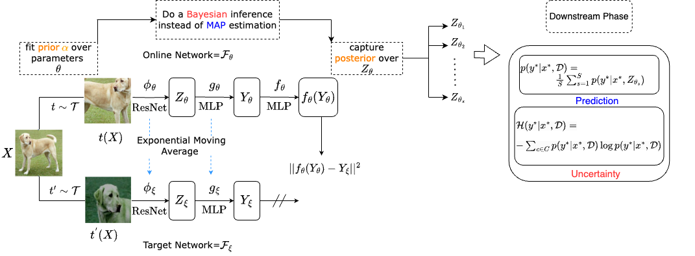

# PSelf-Supervised
### Probabilistic Self-Supervised Learning using Cyclical Stochastic Gradient MCMC
This repository provides PyTorch implimentation of "Probabilistic Self-Supervised Learning using Cyclical Stochastic Gradient MCMC".

arXiv: http://arxiv.org/abs/2308.01271

### Installation
------------------------------------
Install requirements e.g. via 

`pip install -r requirements.txt`

Install `core` module via:

`pip install .`

### Usage
 
To obtain distribution over representations in pretraining phase use `bayesianbyol.py` in `core` module that is based on BayesianByol. Likewise you can take samples from posterior using BayesianSimCLR via `bayesiansimclr`.
To trian the model simply run:

`python bayesianbyol.py`

or

`python bayesiansimclr.py`

For downstream task make different splits of data using `split_datasets.py` in `core` simply via:

`python split_datasets.py`

To evaluate probablistic representations in image classification task use `finetune.py` in `core`. The function finetunes pretrained models using different representations from the posterior on various splits of data. The performance is reported on the test set (or validation set for e.g. in ImageNet-10) by marginalizing over representations. To run the code simply use:

`python finetune.py`

